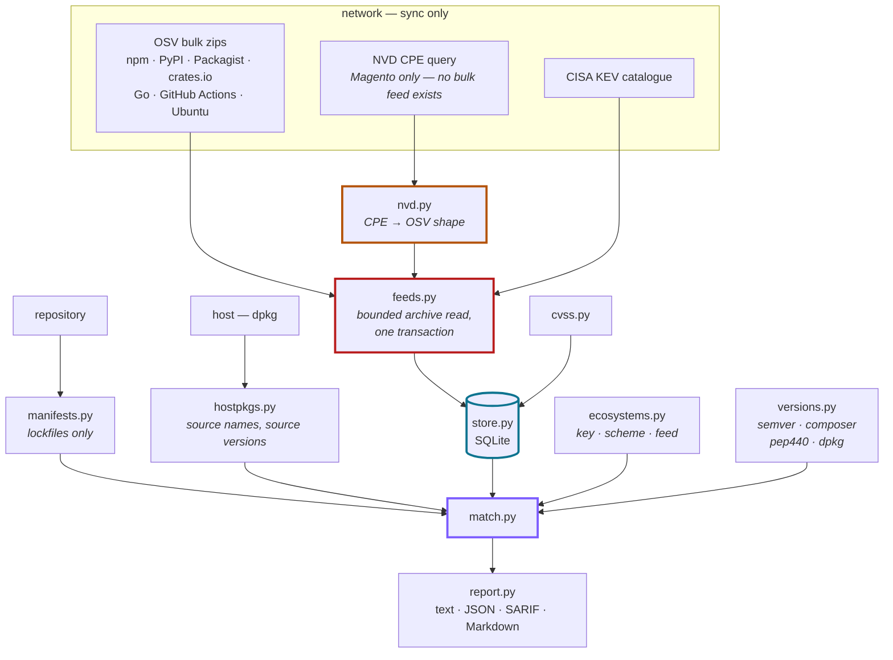

# Architecture

Nine modules, no framework, and one design decision everything else follows
from.

## The decision: download everything, match locally

A dependency scanner has two shapes available to it.

**Ask a server.** For each package, send the name and version and get back a
verdict. Small, fast, always current — and it means the server holds a
complete inventory of what you run, which is a target list.

**Download the feed.** Fetch every advisory once, match offline. Costs 250 MB
and about 30 seconds, and nothing about your code leaves the machine.

`dep-intel` takes the second shape unconditionally. It is why `--offline` is
not a flag: there is no other mode. It is also why the store is SQLite rather
than a cache of API responses — the store *is* the source of truth, and it
has a date on it that every report prints.

## The pipeline

| Module | Responsibility |
|---|---|
| `cli.py` | argument parsing, command dispatch, exit codes |
| `feeds.py` | fetch and ingest OSV + KEV. **The only module that opens a socket.** |
| `store.py` | SQLite schema, migrations, counts |
| `ecosystems.py` | the registry: storage key, comparator name, feed source. **Imports nothing**, so the registry and the comparators cannot depend on each other in a circle. |
| `manifests.py` | find and parse lockfiles |
| `hostpkgs.py` | the operating system's own packages, by **source** name and **source** version |
| `nvd.py` | NVD CPE data converted to OSV shape, so it takes the same ingestion path as every downloaded feed |
| `versions.py` | four version schemes and name normalisation |
| `match.py` | decide affected / not affected / undecided, and apply policy |
| `cvss.py` | CVSS v3.x vector → base score |
| `report.py` | four output formats |
| `test.py` | the gate |

## Why matching is harder than it looks

An OSV `affected` block can carry **ranges**, an enumerated **versions** list,
both, or neither, and the ranges come as a stream of *events* rather than a
list of windows.

**Events, not windows.** `introduced: 1.0.0`, `fixed: 1.5.0`,
`introduced: 3.0.0`, `fixed: 3.5.0` is two disjoint vulnerable windows. Storing
one row per event loses which upper bound belongs to which lower bound, and
then everything between 1.5.0 and 3.0.0 reads as vulnerable. Ranges are
flattened into windows at ingest.

**Ranges are normative, the list is corroboration.** The OSV spec makes
`ranges` authoritative and `versions` a convenience enumeration. So ranges
decide, and agreement between the two raises confidence to `certain` rather
than changing the verdict.

**A GIT range is not a version range.** Its bounds are commit SHAs. Excluding
them is not an optimisation — including them made every advisory that
published one come out `unresolved`.

## The rule: undecided is never clean

Every comparator entry point returns `None` rather than a `bool` when it
cannot decide, and the caller is *required* to surface that as `unresolved`.

This is the one invariant worth protecting in a refactor. A scanner that
converts *I could not check* into *you are fine* manufactures confidence, and
confidence is the entire product. Everything else here — the rollback on a
half-ingested feed, the reported skip when there is no TOML parser, the
coverage-gap line for a constraint file with no lockfile — is the same rule
applied somewhere else.

## Schema

Nine tables. Two are worth explaining.

`affected_range` carries a **`range_type`**, because a GIT range must not be
compared as a version range.

`package` — the local inventory — is keyed by
`(repo, manifest, ecosystem, name, version, scope)`. **`version` is in the key
deliberately**: npm installs several versions of one package in nested
`node_modules`, and a key without it collapses them to whichever was written
last.

Two indexes matter. `affected(ecosystem, package_norm)` serves lookup.
`affected(vuln_id)` serves *ingest*, which rewrites an advisory's rows
wholesale — without it, the first npm sync took 43 minutes instead of 28
seconds.

## Migrations

`SCHEMA_VERSION` in `store.py`. On a mismatch the advisory tables and the
inventory are **dropped**, not upgraded in place.

That is deliberate. The missing column has to be populated from the feed, and
the feed is the only place the value exists — so faking an in-place upgrade
would leave half-migrated rows that match subtly wrongly. Dropping makes
`status` say *0 advisories* and every scan say the store is empty, which is
loud, correct, and thirty seconds from being fixed.

## Testing

`test.py` runs on the standard library and needs no network: OSV archives are
built in memory as zips, and the matcher is exercised against synthetic
advisories covering each decision path — range hit, range miss, enumeration,
open-ended range, two disjoint windows, an unparseable bound, and a GIT range
beside a good one.

**Cases that exist because something was wrong say so in the test name.** That
is not decoration: those are the assertions a later refactor is most likely to
break back, and a test called `test_pep440_dev_below_prerelease` tells the
next person why it is there.
